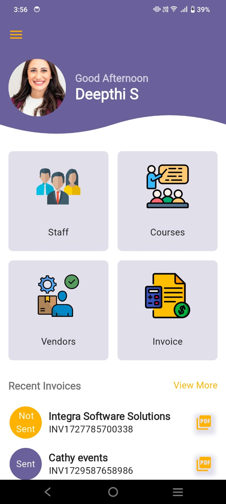
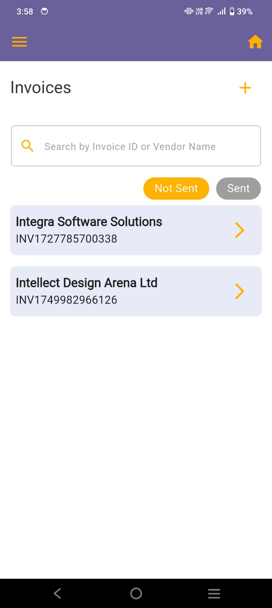
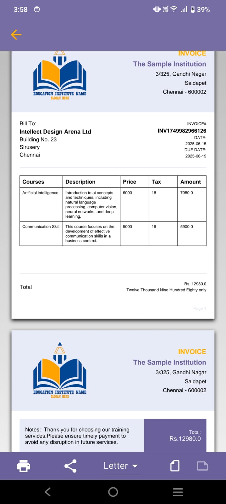

# InvoiceApp

InvoiceApp is a simple Invoice Management Application developed using Flutter and Firebase. This app was created as part of my learning journey in mobile app development. It helps training organizations manage staff, vendors, courses, and generate invoices efficiently.

This is my first complete app built independently using Flutter and Firebase.

## Features

Admin Controls

- Add, update, delete, and search staff, courses, vendors, and invoices

   

   

Invoice PDF Generation

- Dynamically generate multi-page PDF invoices
- Allow vendors to receive and store these invoices easily

  

  

  User Authentication

- Login and registration using Firebase Authentication (Email & Password)

  

Real-Time Database

- Used Cloud Firestore for real-time and structured data storage

Cloud Storage

- Store and retrieve invoice PDFs using Firebase Storage
- Ensures secure and organized document access

As this is my first learning project, I have not used any predefined architecture or state management library (like Provider, GetX, or BLoC) .
